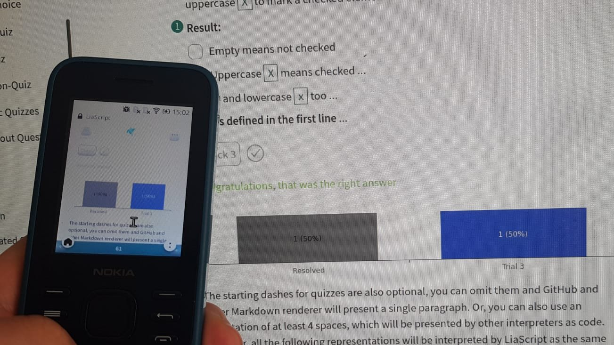

<!--
author:   André Dietrich, Sebastian Zug, Mark Jacob

email:    LiaScript@web.de

version:  0.0.1

language: en

narrator: US English Female

comment:  LiaScript presentation on OER and sustainability at the OER22
          conference in London.

-->


# Open-courSe web development with LiaScript Markdown


## Markdown --> Static text

[Markdown](https://github.com/adam-p/markdown-here/wiki/Markdown-Cheatsheet)  was initially created by John Gruber in 2004 for fast blogging.

1. ~~**Lists**~~
2. ordered or

   * unordered
   * ones ...


| Tables          |        in         |                 Markdown |
|:--------------- |:-----------------:| ------------------------:|
| are             |        ...        |               ___cool___ |
| and can contain | nearly everything | $ f(x) = \frac{1}{x^2} $ |

Images:

[images](https://farm2.static.flickr.com/1618/26701766821_7bea494826.jpg)


## LiaScript --> Interacitivity


### Multimedia

[Photo of Jupiter](https://upload.wikimedia.org/wikipedia/commons/thumb/3/3d/Latest_NASA_photo_of_Jupiter_taken_this_Sunday_by_the_Juno_probe.png/1280px-Latest_NASA_photo_of_Jupiter_taken_this_Sunday_by_the_Juno_probe.png)

[hear a horse](https://www.w3schools.com/html/horse.mp3 "hear a horse")

[Fun with Tables](https://www.youtube.com/watch?v=Y_7q9T5jYHo)

[VTK VolumeContour](https://kitware.github.io/vtk-js/examples/VolumeContour/index.html)

[Circuit simulation](https://www.falstad.com/circuit/circuitjs.html?startCircuit=majority.txt)

[Bust of Nefertiti](https://sketchfab.com/3d-models/bust-of-nefertiti-foia-results-8c60faca6152405e9d35784efa8b9aa1)


### Presentation formats

    --{{0}}--
But you can also include other features such as spoken text.

    --{{1}}--
Reveal Additional content:

      {{1}}
> “Live as if you were to die tomorrow.
> Learn as if you were to live forever.”
>
> -- Mahatma Gandhi

    --{{2}}--
Reveal and hiding is also possible:

     {{2-4}}
Animations work also __inline__: {3 |> Deutsch Male}{Schöne Grüße aus Freiberg.}


    --{{4 Ukrainian Female}}--
Первоначально создан в 2004 году Джоном Грубером (англ. John Gruber) и Аароном
Шварцем. Многие идеи языка были позаимствованы из существующих соглашений по
разметке текста в электронных письмах...

    {{4}}
Type "voice" to see a list of all available languages.


### Quizzes


### Surveys


### Textbased images


### Extendability

https://github.com/topics/liascript-template

``` cpp

byte leds[] = {13, 12, 11, 10};
void setup() {
  Serial.begin(115200);
  for (byte i = 0; i < sizeof(leds); i++) {
    pinMode(leds[i], OUTPUT);
  }
}

int i = 0;
void loop() {
  Serial.print("LED: ");
  Serial.println(i);
  digitalWrite(leds[i], HIGH);
  delay(250);
  digitalWrite(leds[i], LOW);
  i = (i + 1) % sizeof(leds);
}
```


## Problems in OER

<div style="width:100%;height:0;padding-bottom:100%;position:relative;"><iframe src="https://giphy.com/embed/XASpmEbRCZV4pgQOIG" width="100%" height="100%" style="position:absolute" frameBorder="0" class="giphy-embed" allowFullScreen></iframe></div><p><a href="https://giphy.com/gifs/weareeverise-edtech-elearning-educationtechnologyday-XASpmEbRCZV4pgQOIG">via GIPHY</a></p>


### Content last




### Authoring & Community

<div style="width:100%;height:0;padding-bottom:75%;position:relative;"><iframe src="https://giphy.com/embed/qgQUggAC3Pfv687qPC" width="100%" height="100%" style="position:absolute" frameBorder="0" class="giphy-embed" allowFullScreen></iframe></div><p><a href="https://giphy.com/gifs/dommespace-domme-space-programador-qgQUggAC3Pfv687qPC">via GIPHY</a></p>


### Sustainability

")


### Dissemination & Hosting

`https://liascript.github.io/course/?YOUR_COURSE_URL.md`

{{1}}
* ### Plattforms with Version-Control:

  1. [GitHub](https://github.com)
  2. [GitLab](https://gitlab.com)
  3. ...

{{2}}
* ### Web 3.0 with Browser-Support

  1. [Brave-Browser](https://brave.com) with [IPFS](https://ipfs.io)
  2. [Beaker-Browser](https://beakerbrowser.com) with [Hyper](https://hypercore-protocol.org)
  3. ...

{{3}}
* ### Online stores

  1. [DropBox](https://www.dropbox.com)
  2. [NextCloud](https://nextcloud.com/)
  3. ... any ordinary webstore

{{4}}
* ### Collaborative online editors ...

  1. [CodiLia](https://github.com/liascript/codilia)
  2. ...

{{5}}
> __TODO:__ Create an Android App
>
> https://www.npmjs.com/package/@liascript/exporter


## Additional Resources

* __Project-Website:__ https://LiaScript.github.io
* __Open-Source:__ https://github.com/liascript
* __YouTube:__ https://www.youtube.com/channel/UCyiTe2GkW_u05HSdvUblGYg
* __Additional resources:__

- Documentation: https://github.com/LiaScript/docs
- Courses: https://github.com/topics/liascript-course
- Templates: https://github.com/topics/liascript-template
- Blog: https://aizac.herokuapp.com

* __Editor:__ https://atom.io

- Liascript-Preview: https://atom.io/packages/liascript-preview
- Liascript-Snippets: https://atom.io/packages/liascript-snippets

* __Development-Server:__ https://www.npmjs.com/package/@liascript/devserver
